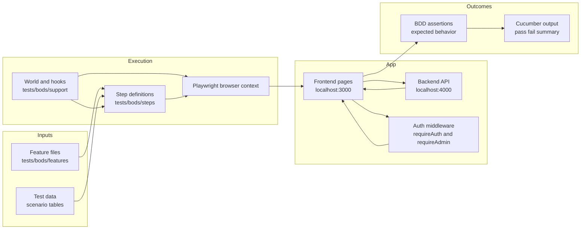

# BODS Test Flow Overview

```mermaid
flowchart LR
  subgraph Inputs
    FEAT[Feature files\ntests/bods/features]
    DATA[Test data\nscenario tables]
  end

  subgraph Execution
    STEP[Step definitions\ntests/bods/steps]
    WORLD[World and hooks\ntests/bods/support]
    PW[Playwright browser context]
  end

  subgraph App
    UI[Frontend pages\nlocalhost:3000]
    API[Backend API\nlocalhost:4000]
    MID[Auth middleware\nrequireAuth and requireAdmin]
  end

  subgraph Outcomes
    ASSERT[BDD assertions\nexpected behavior]
    REPORT[Cucumber output\npass fail summary]
  end

  FEAT --> STEP
  DATA --> STEP
  WORLD --> STEP
  WORLD --> PW
  STEP --> PW
  PW --> UI
  UI --> MID
  MID --> UI
  UI --> API
  API --> UI
  UI --> ASSERT
  ASSERT --> REPORT
```
