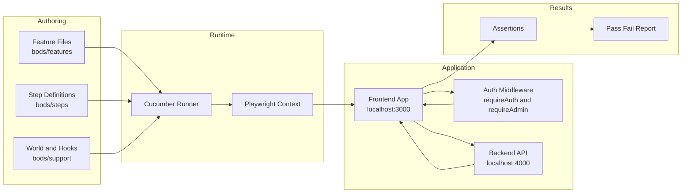

# BODS Overview Diagram

```mermaid
flowchart LR
  subgraph Authoring
    F[Feature Files\nbods/features]
    S[Step Definitions\nbods/steps]
    W[World and Hooks\nbods/support]
  end

  subgraph Runtime
    C[Cucumber Runner]
    P[Playwright Context]
  end

  subgraph Application
    UI[Frontend App\nlocalhost:3000]
    MW[Auth Middleware\nrequireAuth and requireAdmin]
    API[Backend API\nlocalhost:4000]
  end

  subgraph Results
    A[Assertions]
    R[Pass Fail Report]
  end

  F --> C
  S --> C
  W --> C
  C --> P
  P --> UI
  UI --> MW
  MW --> UI
  UI --> API
  API --> UI
  UI --> A
  A --> R
```
