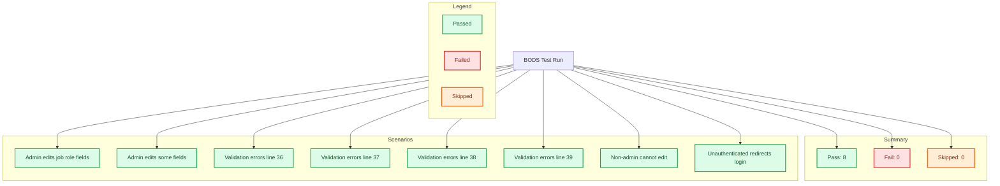

# BODS Test Status Diagram

Source: reports/cucumber-report.json

```mermaid
flowchart TB
  RUN[BODS Test Run]

  subgraph Legend
    LP[Passed]
    LF[Failed]
    LS[Skipped]
  end

  subgraph Summary
    CP[Pass: 8]
    CF[Fail: 0]
    CS[Skipped: 0]
  end

  subgraph Scenarios
    S1[Admin edits job role fields]
    S2[Admin edits some fields]
    S3[Validation errors line 36]
    S4[Validation errors line 37]
    S5[Validation errors line 38]
    S6[Validation errors line 39]
    S7[Non-admin cannot edit]
    S8[Unauthenticated redirects login]
  end

  RUN --> CP
  RUN --> CF
  RUN --> CS

  RUN --> S1
  RUN --> S2
  RUN --> S3
  RUN --> S4
  RUN --> S5
  RUN --> S6
  RUN --> S7
  RUN --> S8

  classDef passed fill:#dcfce7,stroke:#16a34a,color:#14532d,stroke-width:2px;
  classDef failed fill:#fee2e2,stroke:#dc2626,color:#7f1d1d,stroke-width:2px;
  classDef skipped fill:#ffedd5,stroke:#ea580c,color:#7c2d12,stroke-width:2px;

  class LP,CP,S1,S2,S3,S4,S5,S6,S7,S8 passed;
  class LF,CF failed;
  class LS,CS skipped;
```
