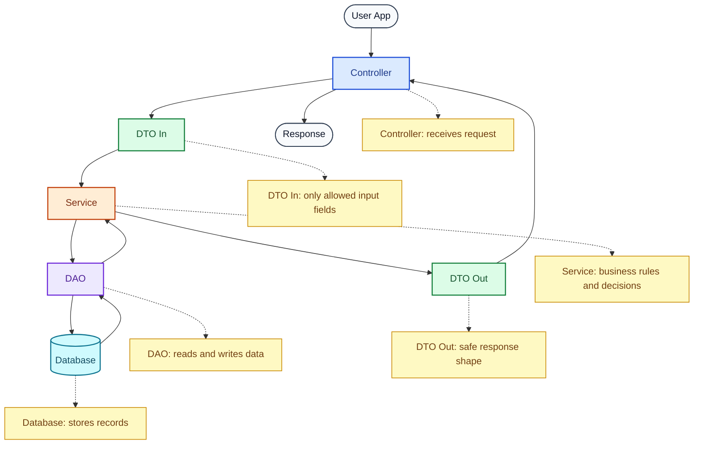

# DAO and DTO Explainer (Clean Version)

```mermaid
flowchart TB
  U([User App]) --> C[Controller]
  C --> DI[DTO In]
  DI --> S[Service]
  S --> DAO[DAO]
  DAO --> DB[(Database)]
  DB --> DAO
  DAO --> S
  S --> DO[DTO Out]
  DO --> C
  C --> R([Response])

  N1[Controller: receives request]
  N2[DTO In: only allowed input fields]
  N3[Service: business rules and decisions]
  N4[DAO: reads and writes data]
  N5[Database: stores records]
  N6[DTO Out: safe response shape]

  C -.-> N1
  DI -.-> N2
  S -.-> N3
  DAO -.-> N4
  DB -.-> N5
  DO -.-> N6

  classDef actor fill:#f8fafc,stroke:#334155,color:#0f172a,stroke-width:1.4px;
  classDef controller fill:#dbeafe,stroke:#1d4ed8,color:#1e3a8a,stroke-width:1.8px;
  classDef dto fill:#dcfce7,stroke:#15803d,color:#14532d,stroke-width:1.8px;
  classDef service fill:#ffedd5,stroke:#c2410c,color:#7c2d12,stroke-width:1.8px;
  classDef dao fill:#ede9fe,stroke:#6d28d9,color:#4c1d95,stroke-width:1.8px;
  classDef db fill:#cffafe,stroke:#0e7490,color:#164e63,stroke-width:1.8px;
  classDef note fill:#fef9c3,stroke:#ca8a04,color:#713f12,stroke-width:1.2px;

  class U,R actor;
  class C controller;
  class DI,DO dto;
  class S service;
  class DAO dao;
  class DB db;
  class N1,N2,N3,N4,N5,N6 note;
```
