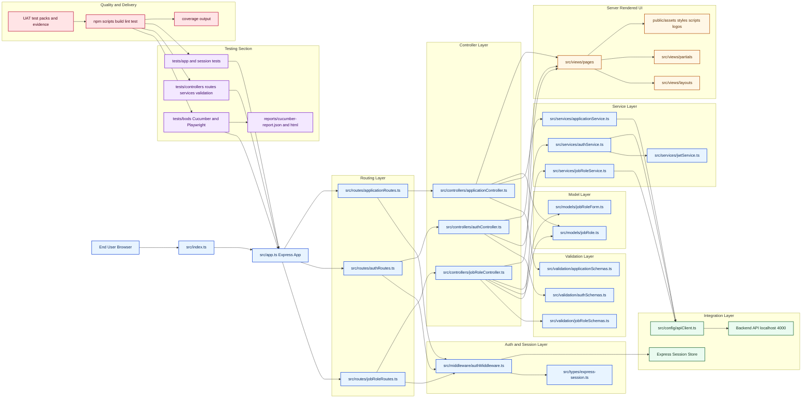

# Team3 Frontend Full Project Architecture

```mermaid
flowchart LR
  %% Entry and runtime
  USER[End User Browser]
  ENTRY[src/index.ts]
  APP[src/app.ts Express App]

  %% Runtime application layers
  subgraph ROUTES[Routing Layer]
    R1[src/routes/jobRoleRoutes.ts]
    R2[src/routes/authRoutes.ts]
    R3[src/routes/applicationRoutes.ts]
  end

  subgraph MIDDLEWARE[Auth and Session Layer]
    M1[src/middleware/authMiddleware.ts]
    M2[src/types/express-session.ts]
  end

  subgraph CONTROLLERS[Controller Layer]
    C1[src/controllers/jobRoleController.ts]
    C2[src/controllers/applicationController.ts]
    C3[src/controllers/authController.ts]
  end

  subgraph VALIDATION[Validation Layer]
    V1[src/validation/jobRoleSchemas.ts]
    V2[src/validation/applicationSchemas.ts]
    V3[src/validation/authSchemas.ts]
  end

  subgraph SERVICES[Service Layer]
    S1[src/services/jobRoleService.ts]
    S2[src/services/applicationService.ts]
    S3[src/services/authService.ts]
    S4[src/services/jwtService.ts]
  end

  subgraph MODELS[Model Layer]
    MD1[src/models/jobRole.ts]
    MD2[src/models/jobRoleForm.ts]
  end

  subgraph PLATFORM[Integration Layer]
    API[src/config/apiClient.ts]
    BACKEND[Backend API localhost 4000]
    SESSION[Express Session Store]
  end

  subgraph VIEWS[Server Rendered UI]
    VW1[src/views/layouts]
    VW2[src/views/pages]
    VW3[src/views/partials]
    ASSET[public/assets styles scripts logos]
  end

  %% Testing and quality
  subgraph TESTING[Testing Section]
    T1[tests/bods Cucumber and Playwright]
    T2[tests/controllers routes services validation]
    T3[tests/app and session tests]
    TR[reports/cucumber-report.json and html]
  end

  subgraph DELIVERY[Quality and Delivery]
    D1[npm scripts build lint test]
    D2[coverage output]
    D3[UAT test packs and evidence]
  end

  %% Primary app flow
  USER --> ENTRY --> APP
  APP --> R1
  APP --> R2
  APP --> R3

  R1 --> M1
  R2 --> M1
  R3 --> M1
  M1 --> M2
  M1 --> SESSION

  R1 --> C1
  R2 --> C3
  R3 --> C2

  C1 --> V1
  C2 --> V2
  C3 --> V3

  C1 --> S1
  C2 --> S2
  C3 --> S3
  S3 --> S4

  C1 --> MD1
  C1 --> MD2
  C2 --> MD1

  S1 --> API
  S2 --> API
  S3 --> API
  API --> BACKEND

  C1 --> VW2
  C2 --> VW2
  C3 --> VW2
  VW2 --> VW1
  VW2 --> VW3
  VW2 --> ASSET

  %% Testing and delivery flow
  T1 --> APP
  T2 --> APP
  T3 --> APP
  T1 --> TR
  D1 --> T1
  D1 --> T2
  D1 --> T3
  D1 --> D2
  D3 --> D1

  %% Professional color system
  classDef runtime fill:#e8f4ff,stroke:#1d4ed8,color:#0b2a5b,stroke-width:1.6px;
  classDef integration fill:#eafbf0,stroke:#166534,color:#12321f,stroke-width:1.6px;
  classDef ui fill:#fff7e6,stroke:#b45309,color:#5b3008,stroke-width:1.6px;
  classDef test fill:#f3e8ff,stroke:#7e22ce,color:#3b0764,stroke-width:1.6px;
  classDef ops fill:#ffe4e6,stroke:#be123c,color:#4c0519,stroke-width:1.6px;

  class USER,ENTRY,APP,R1,R2,R3,M1,M2,C1,C2,C3,V1,V2,V3,S1,S2,S3,S4,MD1,MD2 runtime;
  class API,BACKEND,SESSION integration;
  class VW1,VW2,VW3,ASSET ui;
  class T1,T2,T3,TR test;
  class D1,D2,D3 ops;
```
