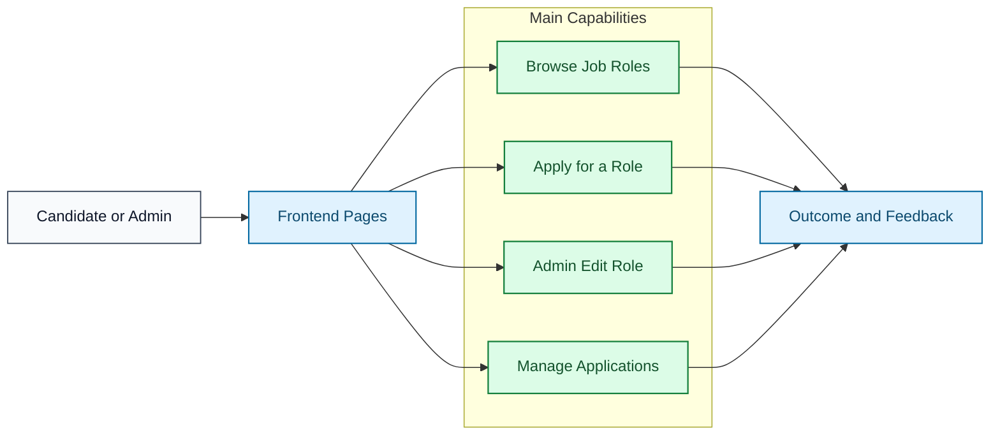

# Show and Tell 01 - Product Flow

```mermaid
flowchart LR
  U[Candidate or Admin]
  P[Frontend Pages]

  subgraph FEATURES[Main Capabilities]
    F1[Browse Job Roles]
    F2[Apply for a Role]
    F3[Admin Edit Role]
    F4[Manage Applications]
  end

  R[Outcome and Feedback]

  U --> P
  P --> F1
  P --> F2
  P --> F3
  P --> F4
  F1 --> R
  F2 --> R
  F3 --> R
  F4 --> R

  classDef actor fill:#f8fafc,stroke:#334155,color:#0f172a,stroke-width:1.2px;
  classDef product fill:#dcfce7,stroke:#15803d,color:#14532d,stroke-width:1.5px;
  classDef support fill:#e0f2fe,stroke:#0369a1,color:#0c4a6e,stroke-width:1.4px;

  class U actor;
  class F1,F2,F3,F4 product;
  class P,R support;
```
