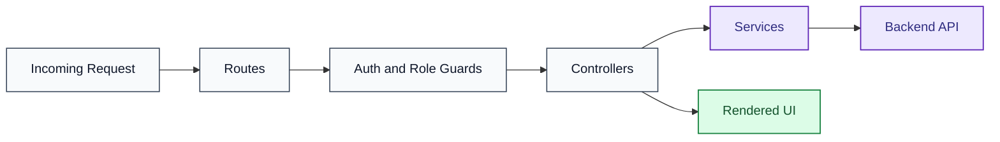

# Show and Tell 02 - Architecture at a Glance

```mermaid
flowchart LR
  REQ[Incoming Request]
  ROUTE[Routes]
  GUARD[Auth and Role Guards]
  CTRL[Controllers]
  SERVICE[Services]
  API[Backend API]
  VIEW[Rendered UI]

  REQ --> ROUTE --> GUARD --> CTRL
  CTRL --> SERVICE --> API
  CTRL --> VIEW

  classDef flow fill:#f8fafc,stroke:#334155,color:#0f172a,stroke-width:1.2px;
  classDef app fill:#e0f2fe,stroke:#0369a1,color:#0c4a6e,stroke-width:1.5px;
  classDef data fill:#ede9fe,stroke:#5b21b6,color:#312e81,stroke-width:1.4px;
  classDef out fill:#dcfce7,stroke:#15803d,color:#14532d,stroke-width:1.4px;

  class REQ,ROUTE,GUARD,CTRL flow;
  class SERVICE,API data;
  class VIEW out;
```
