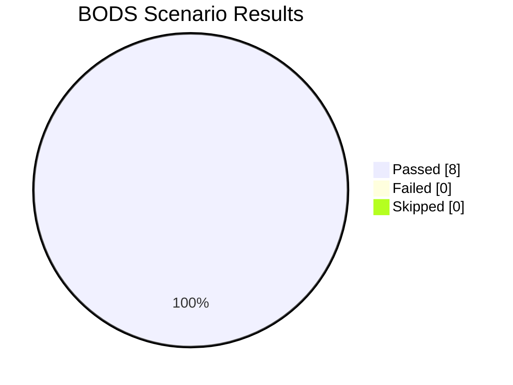
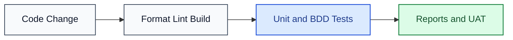

# Show and Tell 03 - Quality Confidence

```mermaid
pie showData
    title BODS Scenario Results
    "Passed" : 8
    "Failed" : 0
    "Skipped" : 0
```

```mermaid
flowchart LR
  CHANGE[Code Change]
  CHECK[Format Lint Build]
  TEST[Unit and BDD Tests]
  EVIDENCE[Reports and UAT]

  CHANGE --> CHECK --> TEST --> EVIDENCE

  classDef base fill:#f8fafc,stroke:#334155,color:#0f172a,stroke-width:1.2px;
  classDef quality fill:#dbeafe,stroke:#1d4ed8,color:#1e3a8a,stroke-width:1.4px;
  classDef trust fill:#dcfce7,stroke:#15803d,color:#14532d,stroke-width:1.4px;

  class CHANGE,CHECK base;
  class TEST quality;
  class EVIDENCE trust;
```
