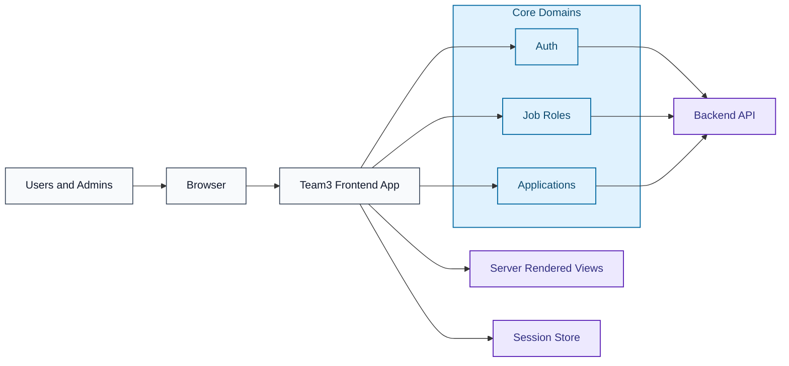

# System Context and Domains

```mermaid
flowchart LR
  USER[Users and Admins]
  BROWSER[Browser]
  APP[Team3 Frontend App]

  subgraph CORE[Core Domains]
    AUTH[Auth]
    ROLES[Job Roles]
    APPLY[Applications]
  end

  BACKEND[Backend API]
  VIEWS[Server Rendered Views]
  SESSION[Session Store]

  USER --> BROWSER --> APP
  APP --> AUTH
  APP --> ROLES
  APP --> APPLY
  AUTH --> BACKEND
  ROLES --> BACKEND
  APPLY --> BACKEND
  APP --> VIEWS
  APP --> SESSION

  classDef neutral fill:#f8fafc,stroke:#334155,color:#0f172a,stroke-width:1.2px;
  classDef domain fill:#e0f2fe,stroke:#0369a1,color:#0c4a6e,stroke-width:1.4px;
  classDef external fill:#ede9fe,stroke:#5b21b6,color:#312e81,stroke-width:1.4px;

  class USER,BROWSER,APP neutral;
  class AUTH,ROLES,APPLY,CORE domain;
  class BACKEND,VIEWS,SESSION external;
```
