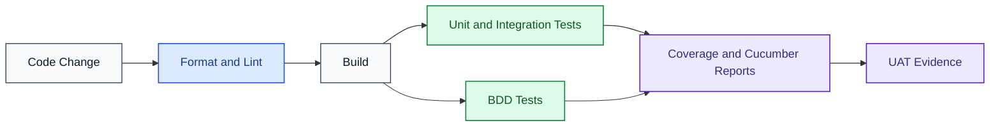

# Testing and Quality Pipeline

```mermaid
flowchart LR
  CHANGE[Code Change]
  FORMAT[Format and Lint]
  BUILD[Build]
  UNIT[Unit and Integration Tests]
  BDD[BDD Tests]
  REPORTS[Coverage and Cucumber Reports]
  UAT[UAT Evidence]

  CHANGE --> FORMAT --> BUILD
  BUILD --> UNIT
  BUILD --> BDD
  UNIT --> REPORTS
  BDD --> REPORTS
  REPORTS --> UAT

  classDef step fill:#f8fafc,stroke:#334155,color:#0f172a,stroke-width:1.2px;
  classDef checks fill:#dbeafe,stroke:#1d4ed8,color:#1e3a8a,stroke-width:1.4px;
  classDef tests fill:#dcfce7,stroke:#15803d,color:#14532d,stroke-width:1.4px;
  classDef outputs fill:#ede9fe,stroke:#5b21b6,color:#312e81,stroke-width:1.4px;

  class CHANGE,BUILD step;
  class FORMAT checks;
  class UNIT,BDD tests;
  class REPORTS,UAT outputs;
```
