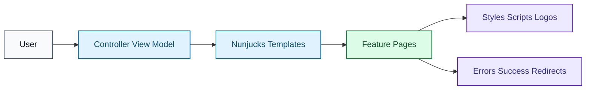

# UI and Asset Surface

```mermaid
flowchart LR
  USER[User]
  CONTROLLER[Controller View Model]
  TEMPLATES[Nunjucks Templates]
  PAGES[Feature Pages]
  ASSETS[Styles Scripts Logos]
  FEEDBACK[Errors Success Redirects]

  USER --> CONTROLLER --> TEMPLATES --> PAGES
  PAGES --> ASSETS
  PAGES --> FEEDBACK

  classDef actor fill:#f8fafc,stroke:#334155,color:#0f172a,stroke-width:1.2px;
  classDef render fill:#e0f2fe,stroke:#0369a1,color:#0c4a6e,stroke-width:1.4px;
  classDef ui fill:#dcfce7,stroke:#15803d,color:#14532d,stroke-width:1.4px;
  classDef support fill:#ede9fe,stroke:#5b21b6,color:#312e81,stroke-width:1.4px;

  class USER actor;
  class CONTROLLER,TEMPLATES render;
  class PAGES ui;
  class ASSETS,FEEDBACK support;
```
